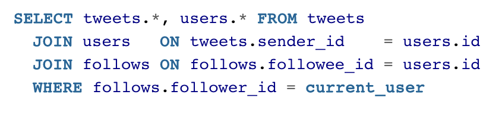
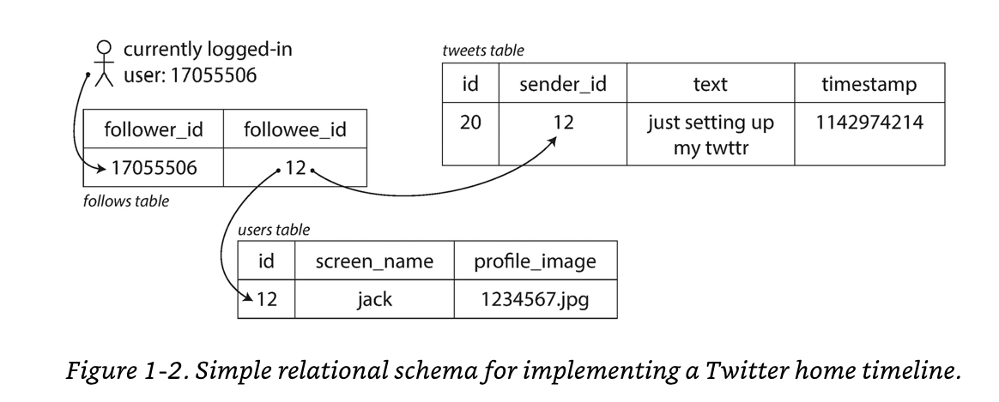
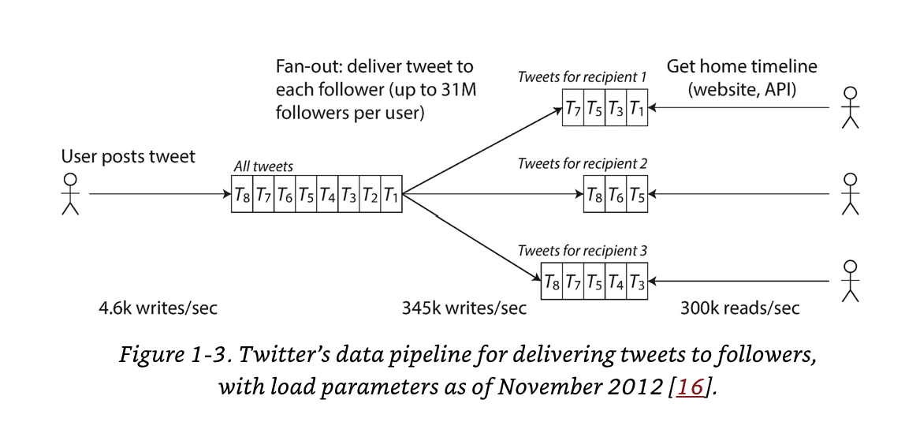

# Designing Data Intensive Applications

Chapter 1

 <!-- Definitions and Why you should care -->

---

# Reliability
- Tolerating hardware and software faults
- Human error

---

# Scalability
- Measuring load & Performance
- Latency percentiles, throughput

---

# Maintainability
- Operability, simplicity, & evolvability

---

# Common requirements of data-intensive applications

* Store data (databases)
* Cache expensive operations (memory stores)
* Allow serach (indexes)
* Asynchronously sending messages (stream processing)
* Crunch data (batch processing)

<!-- Don't use tools for use cases for which they are not optimized. Your database is not a stream processor. -->

---

# Why data systems?

<!-- As opposed to a single service -->

* Tools for data storage and processing are specialized for specific uses.
* No single tool can satisfy all requirements.
* API hides implementation details.

---

# Concerns of data-intensive applications

* Data remains correct and complete
* Provide consistently good performance to clients
* Handle increased load
* User friendly API

<!-- (even when degraded?) -->

---

# Reliability

* The application performs the function that the user expected.
* It can tolerate the user making mistakes or using the software in unexpected ways.
* Its performance is good enough for the required use case, under the expected load and data volume.
* The system prevents any unauthorized access and abuse.

---

# Some quick definitions

Fault is one component of the system deviating from its spec.
Failure is when the system as a whole stops providing the required service to the user.

---

# Chaos Monkey

- Increasing the rate of faults can improve fault-tolerance.
- Google's enforced SLA when they exceed uptime.

<!-- tolerating faults > preventing faults -->

---

# Hardware faults

"Hard disks are reported as having a mean time to failure (MTTF) of about 10 to 50 years. Thus, on a storage cluster with 10,000 disks, we should expect on average one disk to die per day."

<!-- Failures are guaranteed -->

---

# Hardware fault solution?

---

# Redundancy
* RAID
* Hot swap CPU
* Hot swap power supply
* Multiple NICs

---

# Software Errors
* Bugs
* Resource hogs
* Bottlenecks (service is unresponsive or slow)
* Cascading failures (stampeding herd's etc.)

---

 Software Errors are a surprise. Mitigate them by...
* Testing
* Process isolation
* Let it crash!
* Measuring/monitoring

---

# Human Errors
* Design systems in a way that minimizes opportunities for error. (duh?)
* Decouple environments.
* Test Test Test (Balance is hard)
* Enable easy recovery (quick config rollbacks)
* Detailed telemetry
* Runbooks

---

# Scalability is tradeoffs

How can we add resources to handle load?

<!-- This is specific to your system -->

---

# Load
- Systems have different definitions of load
- rps
- DB reads/writes
- Cache hit rate

---

# Twitter example!

Post tweet - 4.6k rps avg 12k rps max
Home timeline - 300k rps

SLO tweets appear within 5s.

<!-- How would you support these requirements? -->

---

Twitter Option 1

<!-- Post tweet - inserts into global collection of tweets
Home timeline - Look up all the people they follow and find all tweets, merge them by time. -->

---

Twitter Option 2 (fanout)

<!-- Post tweet - pushes a tweet into a store for each user
Home timeline - Users read from their store -->

---

Twitter Solution

---

Twitter Solution

---

Throughput (performance) vs Response Time (responsiveness)

---

# Five 9's
[Uptime calculator](https://uptime.is/five-nines)

---

# Amazon cares about 99.9 percentile 1 in 1,000

- Users with the slowest requests have more data, usually mvps
- 99.99 1 in 10,000 was too expensive
- SLOs service level objectives vs SLAs service level agreements
- The slowest backend request is your response time.

---

# Handling Load changes

10,000 -> 100,000 -> 1,000,000 -> 10,000,000

<!-- Different magnitudes require different solutions -->

---

# Scaling

Vertical vs Horizontal scaling
Elastic systems (autoscaling)

<!-- Specific to your system, optimize most common operations

In an early-stage startup or an unproven product it’s usually more important to be able to iterate quickly on product features than it is to scale to some hypothetical future load. -->

---

# Maintainability

- Operability - easy to keep the system running
- Simplicity - easy for new engineers to understand the system
- Evolvability - easy to make changes to the system

---

# Operability
- Monitoring health
- Root causing issues
- Patching
- Understanding system-system side effects
- capacity planning
- Establishing best practices for tools and config
- Maintenance and migration
- Maintaining security
- Predictable operations (deploys)
- Preserve knowledge (Documentation)

---

# Simplicity

Simplicity is not a lack of functionality

<!-- It's understandability -->
---

# Symptoms of Complexity
- Large number of states
- tight coupling of modules
- tangled dependencies
- inconsistent naming and terminology
- perf optimization hacks
- special-case bug fixes

<!-- One of the best tools we have for removing accidental complexity is abstraction. A good abstraction can hide a great deal of implementation detail behind a clean, simple-to-understand façade. -->

---

# Nothing is Something (my favorite talk on abstractions)

https://youtu.be/OMPfEXIlTVE

<!-- My favorite talk on choosing the right abstraction. -->

---

# Evolvability: Making Change Easy

---
