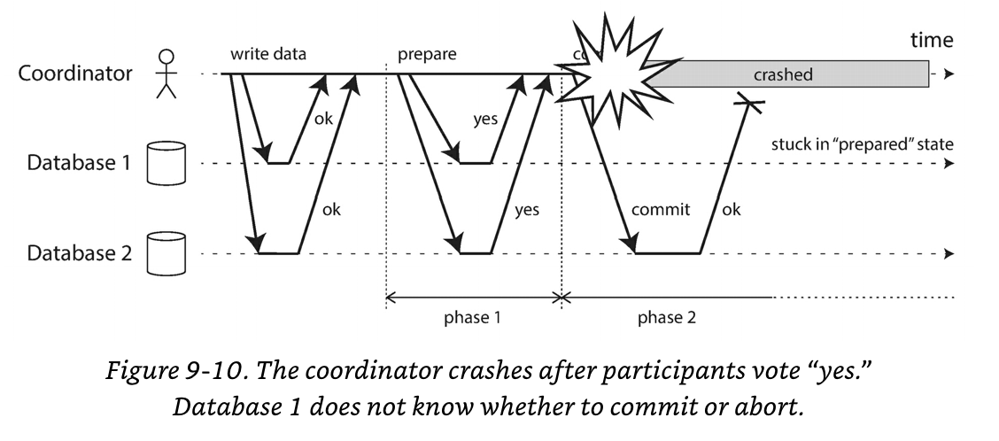

# Consistency and Consensus

---

---

# Generating consensus

- Split brain
- Eventual consistency (convergence)
- Coordinating state

<!-- People don't think about databases in terms of consistency models, they treat it like a variable.

Bugs are hard to find in testing because they're subtle and the app works most of the time. Edge cases only occur when there's a fault in the system.

Distributed Consistency is about coordinating the state of the replicas -->

---

# Linearizability

Goal: Appear as if only one copy of the data and all operations are atomic.

---

---

---

# What makes a system linearizable?

After one read returns the value of the write, all reads must.

---

---

# Even with atomic writes, linearizability is not guaranteed

casc: compare and set

---

---

# Linearizability vs Serializability

- Serializeable: guarantees transactions are executing in some serial order but the order can be different than when they were actually run.
- Linearizeabiliy: guarantees on reads and writes of a register (does not group operations into transactions)

---

# Linearizability vs Serializability

Strict Serializability: provides both linearizability and serializability

---

# Why do we want linearizability?

* Locking and leader election
* Constraints and uniqueness guarantees
* Cross-channel timing dependencies

<!-- Every node that starts up tries to acquire the lock, and the one that succeeds becomes the leader. No matter how this lock is implemented, it must be linearizable: all nodes must agree which node owns the lock; otherwise it is useless. -->

<!-- Uniquie contraints, file name conflicts, bank accounts never going negative

Real world examples, bank accounts never go negative, Taylor Swift tickets, selling only items in stock in the warehouse. Sometimes acceptable to treat lineraizability as a soft guarantee. Flights will bump you if overbooked. -->

<!-- Alice and Bob's soccer score problem only occurred because Alice said something. -->

---

---

# Single-leader replication (sometimes linearizable)

- Leader has the primary copy of the data and followers maintain backups.
- If you read from the leader or synchronously update the followers it can be linearizable.
- Concurrency bugs.
- Likely multiple leaders.

---

# Consensus algorithms (linearizable)

- Have protocols to prevent split brains

---

# Multi-leader replication (not linearizable)

---

# Leaderless replication (not linearizable)
- Requires quorum (w + r > n)
- Last write wins conflict resolution

---

# Linearizability and quorums (Dynamo style)

- Network delays can cause race conditions

---

---

# Linearizability and quorums (Dynamo style)

Linearizability is possible if a reader performs a read repair and a writer reads the latest state of nodes before sending its write. But...

- Riak does not do synchronous read repair due to performance.
- Cassandra does wait for read repair, but is not protected against concurrent writes to the same key (last-write-wins).
- Compare and Set operations cannot be linearizable because they require concensus.

---

# The cost of linearizability

- Multi-leader: Each datacenter continues operating independently, and the conflict is resolved later by merging the two versions of the data.
- Single leader: Followers cannot write and can only read their existing, stale data (potentially nonlinearizeable)

---

<!-- Multi-leader: Each datacenter continues operating independently, and the conflict is resolved later by merging the two versions of the data.
Single leader: Followers cannot write and can only read their existing, stale data (potentially nonlinearizeable) -->

---

# CAP theorem

Consistency, Availability, Partition Tolerance (pick 2)

https://www.geeksforgeeks.org/the-cap-theorem-in-dbms/

---

<!-- Consistent or Available when partitioned

All linearizable databases have this problem. Unreliable networks can occur within datacenters. -->

---

# CAP Theorem Trade-offs

- If applications require linearizability, they must be prepared to handle the case where the database is unavailable when disconnected from the leader.

- If the application does not require linearizability, the replica can process requests independently and can continue to function when disconnected from the leader.

---

# Linearizability and network delays

- Linearizability is not guaranteed on multi-CPU systems without a memory barrier or fence because every CPU has its own cache which is asynchronously updated.
- CPUs avoid CAP Theorem for performance reasons

http://groups.csail.mit.edu/tds/papers/Lynch/podc89.pdf

---

# Linearizability and network delays

More efficient linearizability is not possible. Read and write times are proportional to the uncertainty of delays in the network. Flaky network? Expensive read/writes. Weaker consistency models are faster (Chapter 12).

---

# Ordering Guarantees

- Linarizability: Total order of operations.
- Causality: Two operations are concurrent if neither happened before the other; otherwise they have a partial order.

<!-- Can't have concurrent operations in a Linearizable system. Can have multiple requests queued, but atomic. Concurrency means branches and merge conflicts. -->

---

# Other Options

Linearizability implies causality. There are other solutions.

Note: The following research is not in production systems.

---

# Version Vectors

- Across entire database not just a single key.
- When a transaction wants to commit, the database tracks which data has been read by each transaction.
- Can be impractical if a write is preceded by lots of reads.

---

# Sequence Number Ordering (or timestamps)

---

# Logical Clock

- Logical Clock: An algorithm to generate a sequence of numbers to identify operations, incremented for every operation. Provides a total order for a few bytes.

<!-- Still basically a WAL -->

---

# Noncausal sequence number generators

- For multi-leader or leaderleass systems
- Distinct sets of numbers for each node (ex: Two nodes one with odd one with even numbers)
- Use timestamp to break ties
- Preallocate blocks of squence numbers

---

# These numbers are not consistent with causality

- Throughput, nodes can process different ops/s
- Timestamps skew
- Inconsistent block allocation.

---

# Lamport timestamps

- Each node has a counter and a node id
- Node ID breaks ties
- Cleints keep track of the maximum timestamp they have seen and include it on every request

---

---

# Lamport timestamps

Lamport timestamps not sufficient for creating a unique identifier simultaneously

---

# Total Order Broadcast (atomic broadcast)
- Protocol for exchaning messages between nodes.
- Reliable delivery: No messages are lost, if delivered to one node, delivered to all nodes.
- Totally ordered delivery: All nodes deliver messages in the same order.

<!-- Zookeeper and etcd use this -->

---

# Implementing linearizable storage using total order broadcast

- Total order broadcast is asynchronous, so no guarantees about when they're delivered.
- Linearizability requires that any reads see the latest value written.

---

# Example: Reserving a unique user name

1. Append to the log, indicating the username you want
2. Read from the log, waiting for your message to be delivered
3. Check if your username is in the log, if it's your message commit the username claim and respond to the client; otherwise, abort.

<!-- Provides sequential consistency, not linearizability -->

---

# Linearizability Options

* Sequence reads through the logs by appending a message, reading the log, and performing the actual read when the message is delivered. The message timestamp is your point in time when the read happened.
* Query the latest log message in a linearizable way if possible in your system and wait for entries to catch up. (Zookeeper sync()).
* Read from a synchronous replica updated on writes.

---

# Implementing total order broadcast using linearizable storage

* Increment and get the linearizable integer and use it for the sequence of your message. Send it to all nodes, and the recipients will deliver message consecutively by number.
* Unlike Lamport Timestamps, if a node increment and gotten a 6, it knows it must wait to read 5 before proceeding.

---

How do you implement an increment and get with a linearizable integer?
Consensus algorithm!

---

# Distributed Transactions and Consensus

Note: This is really hard. Getting nodes to agree is hard.

- Leader election: Nodes have to agree, but can't in the case of a network partition.
- Atomic commit: All nodes have to commit or rollback.

---

# Two-Phase Commit

---

# Single node

Single node writes each change and the commit to disk (WAL)

---

# Multi-node problems
- Some nodes may detect a constraint violation or conflict, aborting.
- Some commit requests might be lost in the network and timeout.
- Some nodes may crash before commit.

---

# Two-Phase Commit Coordinator
- Phase 1: Coordinator sends a prepare request to all nodes
- Phase 2: If all participants are ready to commit, commit request sent and takes place. If any participant is not ready to commit, abort request is sent and all participants rollback.

---

---

# How is this different?
1. When an application wants a distributed transaction, it sends a request to the coordinator and receives a globally unique transaction ID
2. The application begins the transaction on each participant with the transaction ID. The coordinator or participants can abort at any time (such as on a node crash).
3. When the applicaiton is ready to commit, the coordinator sends the prepare request to all participants, tagged with the global transaciton ID. If any participant is not ready to commit, it sends an abort request to all participants.
4. Participants verify they can commit the transaction under all circumstances. By replying yes to the coordinator, participants cannot abort the transaction.
5. Coordinator makes the definitive decision to commit or abort. Writes to WAL creating a commit point.
6. Once written to disk, the commit/abort is sent to all participants. The coordinator will retry forever until it succeeds. If a participant crashed, the transaction will be committed when it recovers.

---

# Two points of no return
* Participants responds "yes"
* Coordinator decides to commit or abort

---

# Coordinator Failures

* Before the prepare request is sent, participants can safely abort the request.
* Once responding to the prepare statement, the participant can do nothing but wait. It's not safe for participants to decide whether to commit or abort. This is why the coordinator must write its decision to disk before sending the commit/abort request.

<!-- If the coordinator fails before the prepare request is sent -->

<!-- If the coordinator fails after the prepare statement is sent -->

---

---

# Three-phase commit

Same as two-phase but with timeouts. It requires detecting failure perfectly (impossible due to network issues), but is non-blocking

---

# Distributed transactions have a performance penalty
- MySQL is 10 times slower because it forces fsync (required for crash recovery)

---

# Exactly-once message processing

If message delivery or database transaction fails, the message broker will redeliver the message. This only works if it is committed atomically. (Chapter 11)

---

# X/Open XA transactions

Standard written in 1991 for two-phase commits.

---

# Holding locks while in doubt

Locks have to be held until the coordinator recovers from a crash. This may block reading from those rows.

---

# Recovering from coordinator failure

- Orphaned transactions cannot be resolved automatically. Must be manually resolved.
- XA implementations can break atomicity by allowing participants decide to commit or abort.

---

# Limitations of distributed transactions
- Coordinator is a single point of failure
- Server side applications are stateless, but the coordinator is a part of the application. Coordinator's log is a db
- XA cannot identify deadlocks
- Distributed transactions amplify failures

---

# Fault Tolerant Consensus

One or more nodes may propose values, but the algorithm decides on those values.

---

# Algorithm must satisfy
- Uniform agreement: no two nodes decide differently.
- Integrity: no node decides twice (can't change your mind).
- validity: if a node decides a value, it was proposed by a node (avoid dumb implementations).
- Termination: every node that does not crash eventually decides a value (fault tolerance).

---

# Consensus algorithms and total order broadcast Algorithms

- Viewstamped Replication
- Paxos
- Raft https://raft.github.io

---

# Epoch numbering and quorums

- Consensus protocols can't guarantee there is only one leader, but they can guarantee there is only one leader per epoch.
- New leader vote, new epoch number. In split brain, leader with the higher epoch number wins.
- Leaders need quorum before they can do anything (to ensure nodes agree they're the leader)

---

# Consensus Limitations

- Voting on a proposal is synchronous replication.
- Require a strict majority to operator, minimum three nodes.
- Most algorithms require fixed number of nodes (no dynamically adding)
- Use timeouts to detect failure. Cross-cluster network failures can mark healthy nodes as failed.

---

# Membership and Coordination Services

ZooKeeper and etcd keep all keys in memory; thus, only keep a small number of keys.

---

# ZooKeeper features
- Linearizable atomic operations
- Total ordering of operations
- Failure detection
- Change notificaitons

---

# Use cases
- Allocating work to nodes (Leader election using fewer nodes than workers)
- Service discovery
- Membership services (which nodes are alive and active)

---

# What did we learn?

